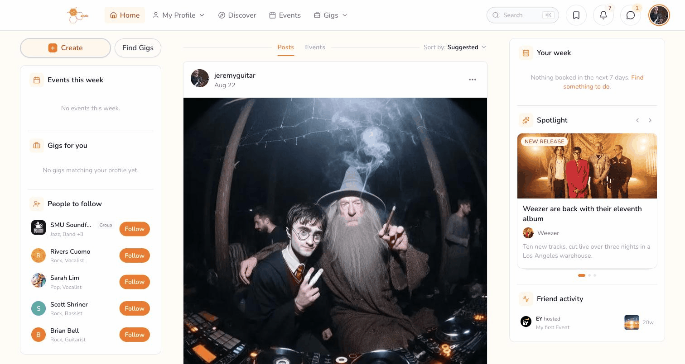

<a name="readme-top"></a>

<div align="center">

# Nectie

**A two-sided marketplace connecting creative talent with the people who book them.**
**LinkedIn + Fiverr, purpose-built for musicians, artists, photographers, and event organisers.**


[](https://nectie.co)
[](https://www.linkedin.com/in/ian-lim-1505a3205/)


</div>

---

### Table of Contents

- [About](#about)
- [A Note on This Repo](#a-note-on-this-repo)
- [Features](#features)
- [Screenshots](#screenshots)
- [Tech Stack](#tech-stack)
- [Architecture](#architecture)
- [Engineering Deep-Dives](#engineering-deep-dives)
- [By the Numbers](#by-the-numbers)
- [Contact](#contact)

## About

Nectie is a two-sided platform where **nebbies** (creative talent — musicians, artists, photographers, emcees) get discovered and booked by **entities** (venues, corporations, event organisers), either solo or as a **group** (a band, ensemble, or crew acting as one account). Bookings flow through **gigs** (one-off jobs) and **events** (public, ticketed, RSVP'd), with a matched **project** workspace once a gig is accepted.

Built solo, end to end — product decisions, schema design, UI, and infrastructure — from a blank repo in January 2026 to a production app processing real Stripe payments today. A React Native (Expo) mobile app is in active development alongside it, sharing one typed data layer with the web app rather than reimplementing it.

<p align="right">(<a href="#readme-top">back to top</a>)</p>

## A Note on This Repo

**This repo intentionally contains no application code.** The real implementation — 795 commits, ~60 routes, a 41-table schema, and everything below — lives in a private repository.

What you *can* see here: a live, working product at [nectie.co](https://nectie.co), and an honest write-up of what got built, how it's architected, and the specific problems solved along the way — including the ones that were actually hard. I'd rather show real screenshots and real engineering stories than a code dump with the interesting parts (auth, payment logic, business rules) stripped out to make it safe to publish.

<p align="right">(<a href="#readme-top">back to top</a>)</p>

## Features

- 🎭 **Two-sided marketplace** — nebbies build a portfolio and set availability; entities post gigs and hire directly, no middleman bidding war.
- 👥 **Group accounts as first-class actors** — a band or crew can post, apply, RSVP, message, and collect reviews *as itself*, not just through individual members.
- 🎟️ **Full event lifecycle + ticketing** — create/edit/cancel, RSVP, Stripe Connect–backed paid ticketing, QR check-in at the door, performer lineups, and post-event photo albums.
- 💼 **Structured gig postings** — tech riders, backline requirements, payment terms, and stage plots baked into the posting flow, not left to a DM thread.
- 🧱 **Block-based portfolio builder** — 17 content block types (hero, media gallery, audio/video embeds, stats, testimonials, resume, hosted-events, …), 5 presets, live preview, per-block theming.
- 🗺️ **Map-based discovery** — Leaflet + OpenStreetMap geolocation search across gigs, events, nebbies, groups, and entities.
- 💬 **Realtime messaging** — DMs and project-specific chat threads, with folder organisation and realtime delivery.
- 📅 **Availability & booking calendar** — recurring rules, per-date overrides, and an instant-booking toggle.
- 📰 **Ranked social feed** — posts, comments, likes, follows; infinite scroll with a tuned relevance score (host > performer > attendee > shared-tag), not a raw reverse-chronological dump.
- 🔒 **Granular privacy controls** — per-profile visibility settings for profile, posts, portfolio, calendar, and who can message you.

<p align="right">(<a href="#readme-top">back to top</a>)</p>

## Screenshots

<div align="center">



*Live walkthrough: the feed, map-based Discover, an event's organizer view, and the block-based portfolio builder — recorded straight from [nectie.co](https://nectie.co).*

</div>

<p align="right">(<a href="#readme-top">back to top</a>)</p>

## Tech Stack

| Layer | Stack |
|---|---|
| **Web** | Next.js 16 (App Router) · React 18.3 · TypeScript · Tailwind CSS · Framer Motion |
| **Mobile** | React Native 0.86 (Expo SDK 57) · React 19 · NativeWind · Reanimated |
| **Data** | Supabase (Postgres, Auth, Storage) — 41 tables |
| **Payments** | Stripe Connect — destination charges, refunds, payouts |
| **Other** | Resend (transactional email) · Leaflet + OpenStreetMap (map discovery) |
| **Infra** | Vercel · npm workspaces monorepo |

<p align="right">(<a href="#readme-top">back to top</a>)</p>

## Architecture

One monorepo, two consumer apps, converging on a shared data layer instead of duplicating query logic:

```
nectie/
├── nectie-mvp/        → production Next.js web app
├── nectie-mobile/      → React Native (Expo) app — the primary target;
│                         web is the try-before-you-download surface
└── packages/
    ├── core/           → platform-neutral query functions, shared by both apps
    └── tokens/          → shared design tokens
```

`packages/core` holds pure functions that take a Supabase client as an argument instead of creating one — no `next/*` imports, no DOM globals, enforced by ESLint so the mobile bundler (Metro) can consume exactly the same code the web app runs. The governing rule: **no query gets two implementations.** The moment mobile needs a query the web already has, the web's version is extracted into `core` and the web call site is migrated in the same change — never duplicated. A running log (`schema-findings.md`, in the private repo) tracks every type mismatch that extraction has caught — each one was a latent bug already live on web before it was found.

<p align="right">(<a href="#readme-top">back to top</a>)</p>

## Engineering Deep-Dives

A few specific problems worth telling, because "I use Next.js and Supabase" doesn't say much on its own.

<details>
<summary><strong>🔎 The audit that found a months-old silent failure</strong></summary>
<br>

A routine performance check noticed an idle, logged-out browser tab firing **334 Supabase requests in 25 seconds** — an infinite refetch loop from an unstable array reference in a `useEffect` dependency list. Chasing that one bug backward led to something much bigger: a version mismatch between `@supabase/ssr` and `@supabase/supabase-js` had changed a generic type signature, and as a result **every Supabase query in the app had been typed as returning `never[]`** — silently, for months. The compiler never caught it. The workaround that seemed to fix it, `as any`, had been applied 381 times across the codebase, and two queries were silently hitting tables that didn't exist in production.

Fixing the root cause and removing all 381 casts restored real type safety app-wide — and incidentally surfaced a stored-XSS gap where the sanitization library silently no-op'd during server-side rendering.

**What this taught me:** a type error you keep suppressing isn't a UI annoyance, it's a symptom — and a dependency upgrade needs to be checked against the types it promises, not just whether the build still passes.

</details>

<details>
<summary><strong>🎟️ The ticketing overhaul</strong></summary>
<br>

Before building a full ticketing system, I read through how Eventbrite, Peatix, Posh, and Luma structure fees and payouts, and used that to pressure-test Nectie's own numbers. Two things fell out of that review before a single ticket had sold in production:

- The fee schedule was **losing money on every order below a threshold price** — a plan that looked fine on paper broke on the cheap end.
- Ticket prices were being stored and passed to Stripe in the wrong unit — a bug that, uncaught, would have charged a customer roughly **100x the listed price** on the very first live sale.

The resulting rebuild spanned 10 phases: correct unit handling, a working refund flow (the original design cost the platform 100% of a refunded order because it never issued the Stripe transfer reversal), and a repositioning of the product thesis — Nectie can offer something competitors can't by owning both the "who do I book" and "how do I sell tickets to it" sides of the same event.

**What this taught me:** the scariest bugs in a payments system aren't crashes, they're silent unit/logic errors that only show up as a wrong number on someone's card statement — payment code needs adversarial review before launch, not just after.

</details>

<details>
<summary><strong>⚙️ Cross-tool configuration traps</strong></summary>
<br>

Running the same repo across two different AI coding agents (Claude Code and opencode) surfaced a subtle config precedence bug: opencode's instruction loader stops at the first `AGENTS.md` it finds walking up the directory tree and never evaluates `CLAUDE.md` after that — even a three-line `AGENTS.md` meant for something unrelated silently blanked out load-bearing build configuration for an entire subproject. Fixed by making the instruction file list explicit rather than relying on discovery order.

**What this taught me:** implicit "first match wins" config resolution is a trap the moment more than one tool reads the same directory — be explicit, don't rely on discovery order.

</details>

<p align="right">(<a href="#readme-top">back to top</a>)</p>

## By the Numbers

<div align="center">


</div>

<p align="right">(<a href="#readme-top">back to top</a>)</p>

## Contact

<div align="center">

**Ian Lim Zhen Jun**

[](https://www.linkedin.com/in/ian-lim-1505a3205/)

</div>

<p align="right">(<a href="#readme-top">back to top</a>)</p>
